# SIBapp

## Overview

SIBapp is a role-based organizational management platform designed to digitally manage members, chapters, regions, events, meetings, and activity analytics for a structured association.  
It centralizes governance workflows, improves transparency, and provides data-driven insights for different leadership roles.

The application supports multi-level access control (Members, Coordinators, Presidents, Admins) and combines dashboards, analytics, and workflow automation in a single system.

---

## Tech Stack

### Frontend

- **React (Vite)**
- **React Router DOM**
- **Tailwind CSS**
- **Recharts** (analytics & graphs)
- **Firebase SDK** (authentication & storage initialization)
- **GSAP** (animations)

### Tooling & Deployment

- **Vite**
- **ESLint**
- **Vercel** (deployment)

### Backend (External)

- **Custom REST API**
- **Session-based authentication** (cookies)
- **Role-based authorization**

> **Note:** Backend and database are maintained as a separate service and are not part of this repository.

---

## Key Features

- Role-based dashboards (Member, Coordinator, President, Admin)
- Secure session-based authentication
- Chapter, region, and vertical management
- Member directory with advanced filtering
- Event and meeting management
- Activity tracking (M2M, Referrals, TYFTB)
- Analytics and reporting dashboards
- Notification and alert system
- Public and private portals
- Media-rich galleries and assets

---

## Project Architecture (High Level)

```
Browser
    ↓
React SPA (SIBapp)
    ↓
Backend REST API
    ↓
Database & Auth System
```

- **Frontend** handles UI, routing, and API consumption
- **Backend** owns authentication, authorization, and business logic
- **Database** stores members, activities, events, analytics, and media metadata
- The frontend never directly accesses the database.

---

## Architecture

The following diagram represents the high-level system architecture, clearly separating user roles, frontend responsibilities, backend services, and infrastructure dependencies. It is written using Mermaid and can be rendered directly by GitHub.

```mermaid
graph TD
    %% Styles
    classDef frontend fill:#e1f5fe,stroke:#01579b,stroke-width:2px,color:#01579b;
    classDef backend fill:#e8f5e9,stroke:#2e7d32,stroke-width:2px,color:#2e7d32;
    classDef user fill:#fff9c4,stroke:#fbc02d,stroke-width:2px,color:black;
    classDef ext fill:#f3e5f5,stroke:#7b1fa2,stroke-width:2px,color:#4a148c;
    classDef public fill:#ffebee,stroke:#c62828,stroke-width:2px,color:#c62828;

    %% =====================
    %% User Actors
    %% =====================
    subgraph "User Actors"
        A["Admin (Region Owner)"]:::user
        P["President"]:::user
        C["Coordinator"]:::user
        M["Member"]:::user
        V["Public Visitor"]:::user
    end

    %% =====================
    %% Frontend Layer
    %% =====================
    subgraph "Frontend Layer (React + Vite + Tailwind)"

        subgraph "Public Zone"
            Hero["Hero Page"]:::public
            PubGal["Public Gallery (Approved M2M Proofs)"]:::public
        end

        subgraph "Authentication"
            Login["Login UI"]:::frontend
        end

        subgraph "Protected Dashboards"
            AD["Admin Dashboard"]:::frontend
            PD["President Dashboard"]:::frontend
            CD["Coordinator Dashboard"]:::frontend
            MD["Member Dashboard"]:::frontend

            Viz["Recharts – Analytics"]:::frontend
            Anim["GSAP – Animations"]:::frontend
        end
    end

    %% =====================
    %% Backend Layer
    %% =====================
    subgraph "Backend Layer (Custom REST API)"
        API["API Gateway / Controllers"]:::backend
        AuthMw["Session & Role-based Auth Middleware"]:::backend

        subgraph "Business Logic Services"
            RegSvc["Region & Chapter Service"]:::backend
            MemSvc["Membership Service"]:::backend
            SlipSvc["Slip / Referral Service"]:::backend
            NotifSvc["Notification Service (Email + In-App)"]:::backend
        end
    end

    %% =====================
    %% Data & Infrastructure
    %% =====================
    subgraph "Data & Infrastructure"
        FBAuth["Firebase Authentication"]:::ext
        FBStore["Firebase Storage"]:::ext
        DB["Primary Database"]:::ext
    end

    %% =====================
    %% Authentication Flow
    %% =====================
    Login -->|Authenticate| FBAuth
    FBAuth -->|JWT / ID Token| Login
    Login -->|Send Token| API
    API -->|Set Session Cookie| Login

    %% =====================
    %% User Navigation
    %% =====================
    V --> Hero
    V --> PubGal
    A --> AD
    P --> PD
    C --> CD
    M --> MD

    %% =====================
    %% Permission Hierarchy (Read-only Views)
    %% =====================
    PD -.->|Read-only Supervision| CD
    AD -.->|Global Oversight| PD

    %% =====================
    %% Dashboard Actions
    %% =====================
    AD -->|Create Regions / Chapters| RegSvc
    AD -->|Broadcast Notifications| NotifSvc

    PD -->|Create Members / Events| MemSvc
    PD -->|Revoke Roles| MemSvc

    CD -->|Mark Attendance| MemSvc
    CD -->|Approve / Reject Slips| SlipSvc
    CD -->|Low Attendance Alerts| NotifSvc

    MD -->|Submit TYB / Referral / M2M| SlipSvc
    MD -->|Upload Proof| FBStore
    FBStore -->|Proof URL| SlipSvc

    %% =====================
    %% Public Gallery Flow
    %% =====================
    SlipSvc -->|Fetch Approved M2M| PubGal
    FBStore -->|Serve Images| PubGal

    %% =====================
    %% Backend Processing
    %% =====================
    API --> AuthMw
    AuthMw --> RegSvc
    AuthMw --> MemSvc
    AuthMw --> SlipSvc
    AuthMw --> NotifSvc

    RegSvc --> DB
    MemSvc --> DB
    SlipSvc --> DB
    NotifSvc --> DB

    %% =====================
    %% Notifications
    %% =====================
    NotifSvc -->|Email| A
    NotifSvc -->|Email| P
    NotifSvc -->|Email| C
    NotifSvc -->|Email| M
    NotifSvc -->|In-App Notifications| DB

    AD -.->|Fetch Notifications| NotifSvc
    PD -.->|Fetch Notifications| NotifSvc
    CD -.->|Fetch Notifications| NotifSvc
    MD -.->|Fetch Notifications| NotifSvc
```




---

## Getting Started

### Prerequisites

- Node.js (v18 or higher recommended)
- npm or yarn
- Backend API running (required for full functionality)
- Environment variables configured

### Installation

```bash
git clone https://github.com/your-username/SIBapp.git
cd SIBapp
npm install
```

### Environment Variables

Create a `.env` file in the root directory:

```env
VITE_APIKEY="your-firebase-api-key"
VITE_AUTHDOMAIN="your-firebase-auth-domain"
VITE_PROJECTID="your-firebase-project-id"
VITE_STORAGEBUCKET="your-firebase-storage-bucket"
VITE_MESSAGINGSENDERID="your-firebase-messaging-sender-id"
VITE_APPID="your-firebase-app-id"
VITE_MEASUREMENTID="your-firebase-measurement-id"
VITE_BACKEND_SERVER="https://api.senguntharinbusiness.in"
```

### Run Locally

```bash
npm run dev
```

The app will be available at:  
[http://localhost:5173](http://localhost:5173)

---

## Folder Structure

```
SIBapp/
├─ public/              # Static assets and images
├─ src/
│  ├─ hooks/            # Auth, routing, and data hooks
│  ├─ utils/            # Utility and helper functions
│  ├─ Components/       # Reusable UI components
│  ├─ Admin/            # Admin portal
│  ├─ Members/          # Member directory & analytics
│  ├─ ChapterPage/      # Chapter-level views
│  ├─ Coordinatorsportal/
│  ├─ PresidentPortal/
│  ├─ MyActivity/       # Activity tracking
│  ├─ Meetings/         # Meetings management
│  ├─ ProfilePage/
│  ├─ Settings/
│  ├─ SigninPage/
│  ├─ NotificationPanel/
│  └─ src1/             # Legacy public/marketing site
├─ vite.config.js
├─ package.json
└─ README.md
```

---

## Contribution Guide

We welcome contributions from the community.

Please read the contribution guidelines before submitting a pull request:

➡️ [CONTRIBUTING.md](CONTRIBUTING.md)

**General guidelines:**

- Follow existing folder and naming conventions
- Write clear commit messages
- Test your changes before submitting
- Open an issue before working on major changes

  Contributions are welcome for:

- Bug fixes
- New features
- Documentation improvements
- Performance and security enhancements


---

## Community & Contact

- **Author:** Prem Kumar R  
- **GitHub:** [https://github.com/prem-ramamoorthy](https://github.com/prem-ramamoorthy)
- **email:** prem2005.developer@gmail.com  
- **Project Discussions:** Use GitHub Issues and Pull Requests

For major changes, open an issue first to discuss your proposal.

---


## License

This project is licensed under the MIT License.  
See the [LICENSE](LICENSE) file for details.
